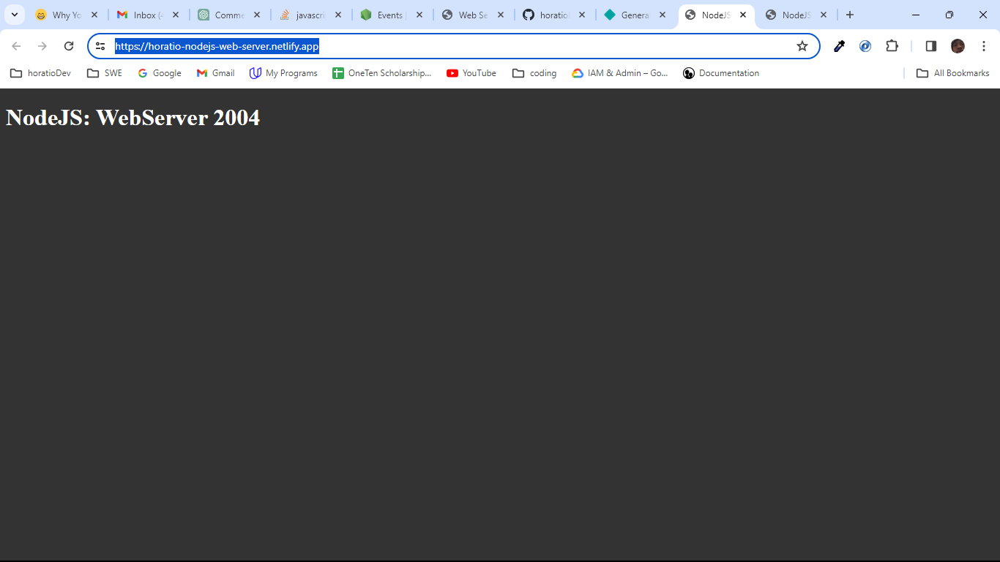

# Node.js Web Server
A simple Node.js web server that serves static files and handles different content types. This project provides a basic foundation for building web servers in Node.js and includes functionality for serving HTML, CSS, JavaScript, and images. Feel free to use it as a starting point for your web development projects.

[Live Demo](https://horatio-nodejs-web-server.netlify.app/)

Key Features:
- Static file serving
- Content type handling
- Sample REST API endpoint (commented out in the code)

Getting Started:
1. Clone the repository.
2. Install dependencies with npm install.
3. Run the server with npm run start.

Project Structure:
1. **webServer.js**: Main server script.
2. **public/**: Directory containing static files (HTML, CSS, JS, images, etc.).

Examples:
- https://horatio-nodejs-web-server.netlify.app/ - Home page
- https://horatio-nodejs-web-server.netlify.app/about - About page (commented out in the code)
- https://horatio-nodejs-web-server.netlify.app/unknown - 404 Page Not Found

Explore the project structure, customize it according to your needs, and contribute to its development. Feel free to contribute by opening issues or submitting pull requests.

License: MIT
